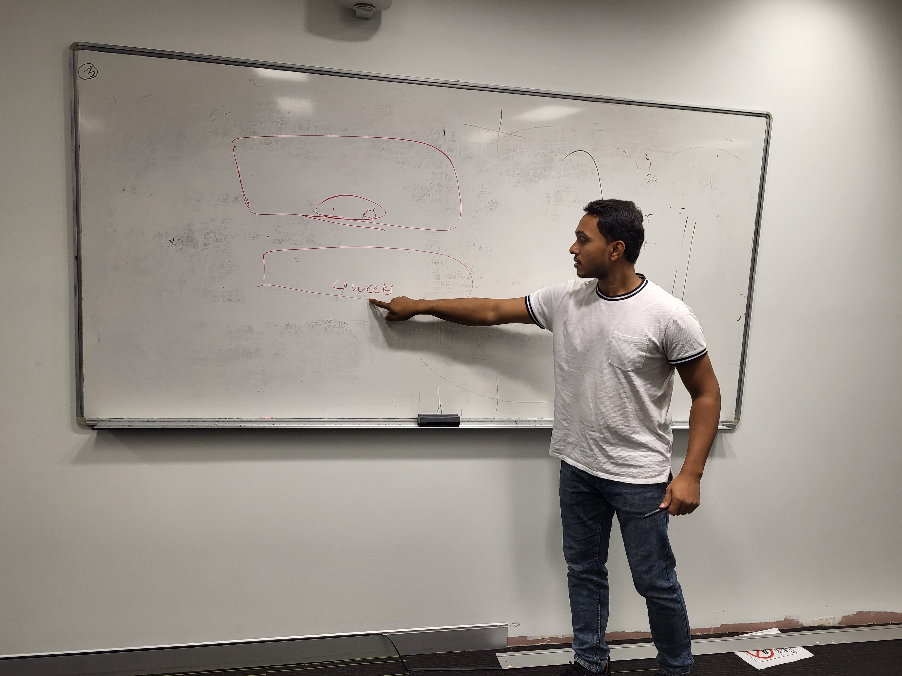
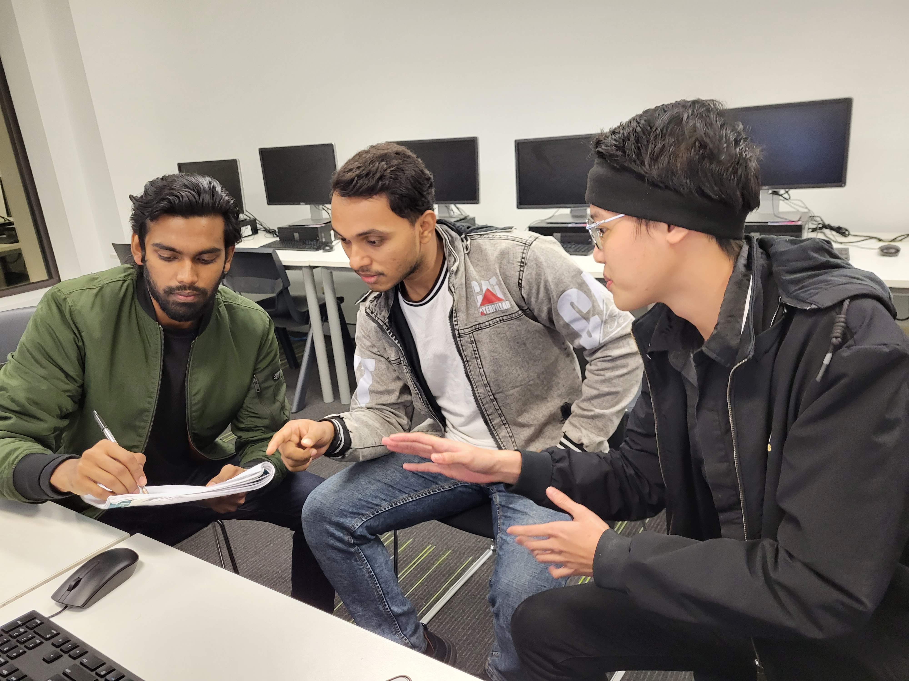
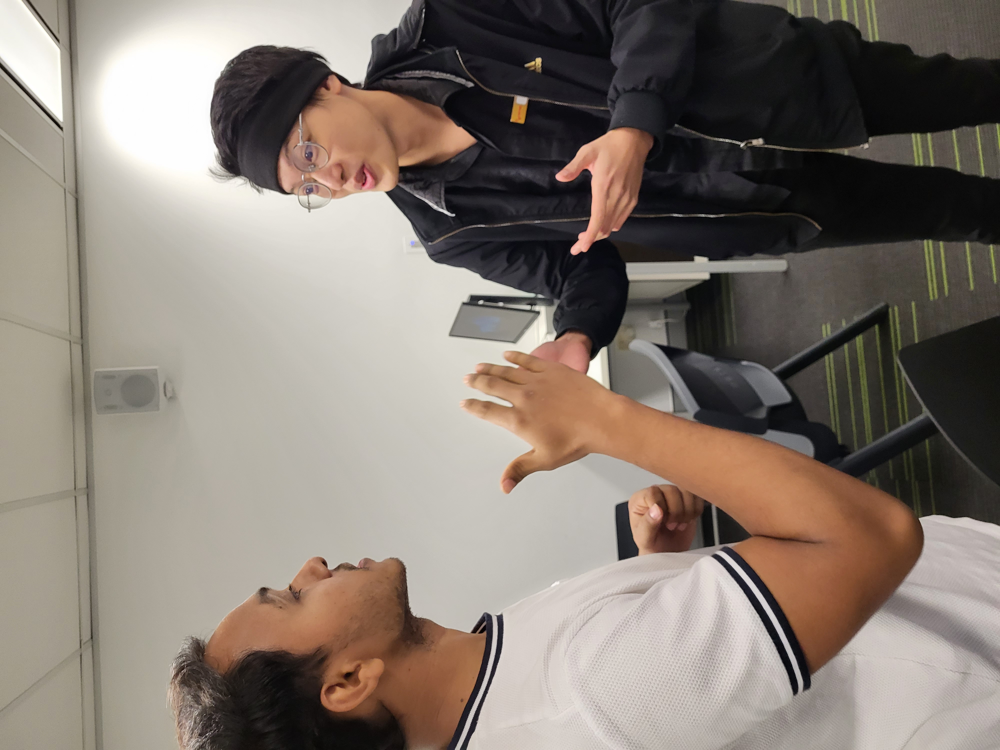
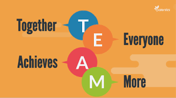

# ePortfolio
<!DOCTYPE html>
<html>
<body>

<h1>communication concepts and strategies</h1>
  
<h1>Show confidence and skills in oral communications and presentations</h1>
   
<h1>Work effectively as part of a team</h1>
   
<h1>Communicate effectively in a professional context</h1>
  
<h1> Define and demonstrate conflict management and resolution strategies</h1>

</body>
</html>
