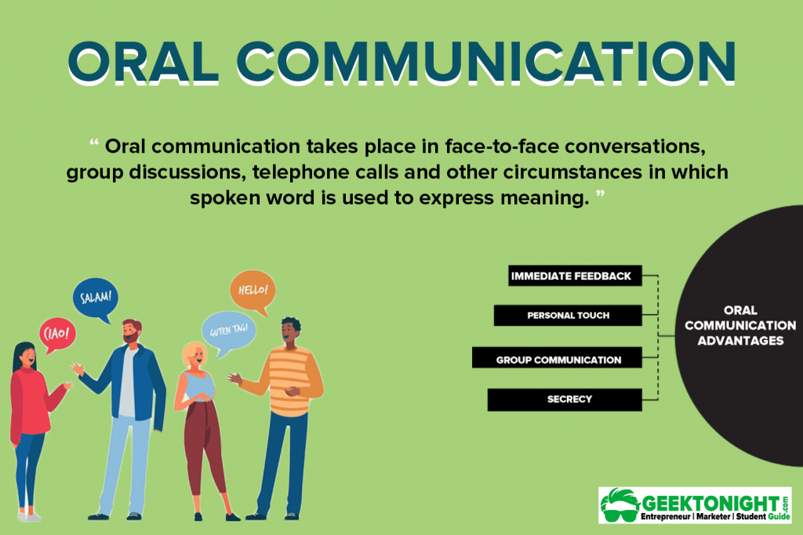
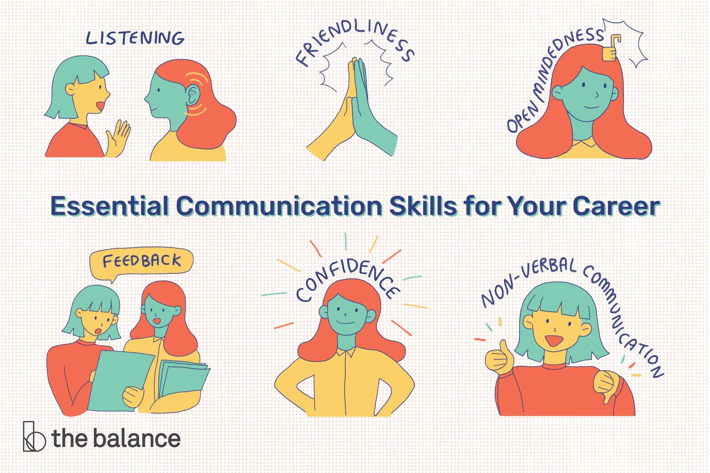

# ePortfolio
<!DOCTYPE html>
<html>
<body>

<h1>communication concepts and strategies</h1>
  
<h2>Show confidence and skills in oral communications and presentations</h2>
   
<h3>Work effectively as part of a team</h3>
   
<h4>Communicate effectively in a professional context</h4>
  
<h5> Define and demonstrate conflict management and resolution strategies</h5>

</body>
</html>
